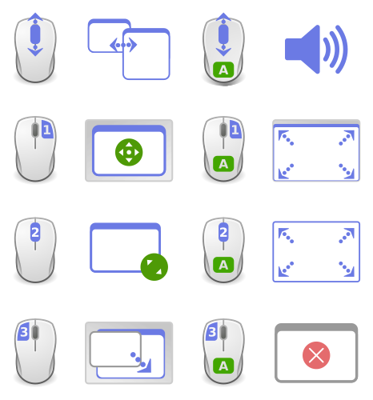

# gnome-shell-alt-mouse
Alt + Mouse control window

---

-| scroll up/down | butt 1|butt 2(middle)|butt 3
---|---|---|---|---
panel/desktop[^1] | switch window|move[^3]|resize|lower[^2]
Alt + |volume|max[^3]|fullscreen[^4]|close

[^1]: 鼠标三个按钮需要在桌面**双击**才有效。The three mouse buttons need to be **double clicked** on the desktop to be effective.
[^2]: 窗口置底/最小化后，滚轮下滚，可立刻恢复原貌。After the window is lower / minimized, the roller rolls down to restore the original appearance immediately.
[^3]: issue: 有最大化窗口时，窗口正上方的面板点击按钮1失效，变成直接提升最大化的那个窗口。When there is a maximization window, click button 1 on the panel directly above the window fails and becomes raise the maximization window directly.
[^4]: 全屏后，窗口不能缩小，只能提前设置热键操作(比如Alt-F12)恢复。除开在全局取得控制权。 After full screen, the window cannot be reduced, and can only be restored by setting hotkey operation (such as alt-f12) in advance. Apart from gaining control of the whole situation.

