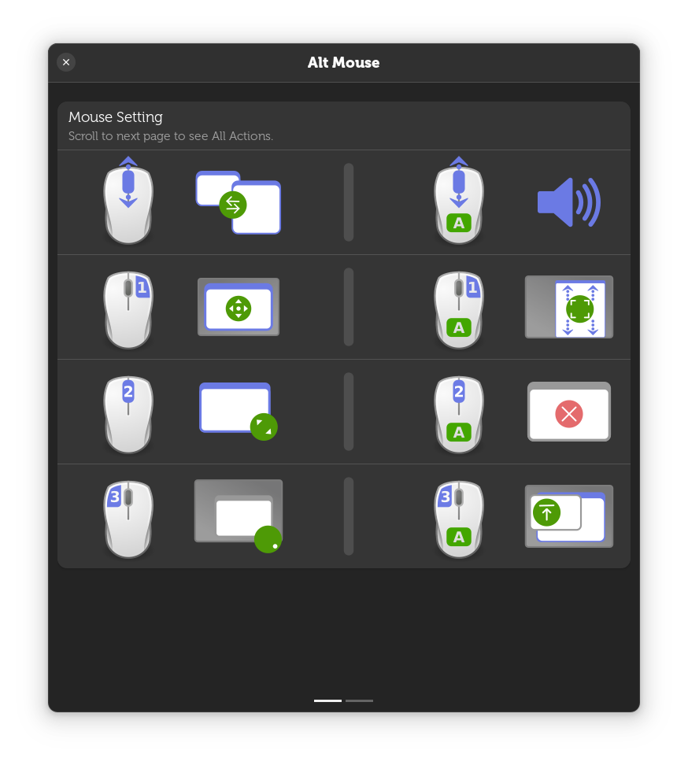
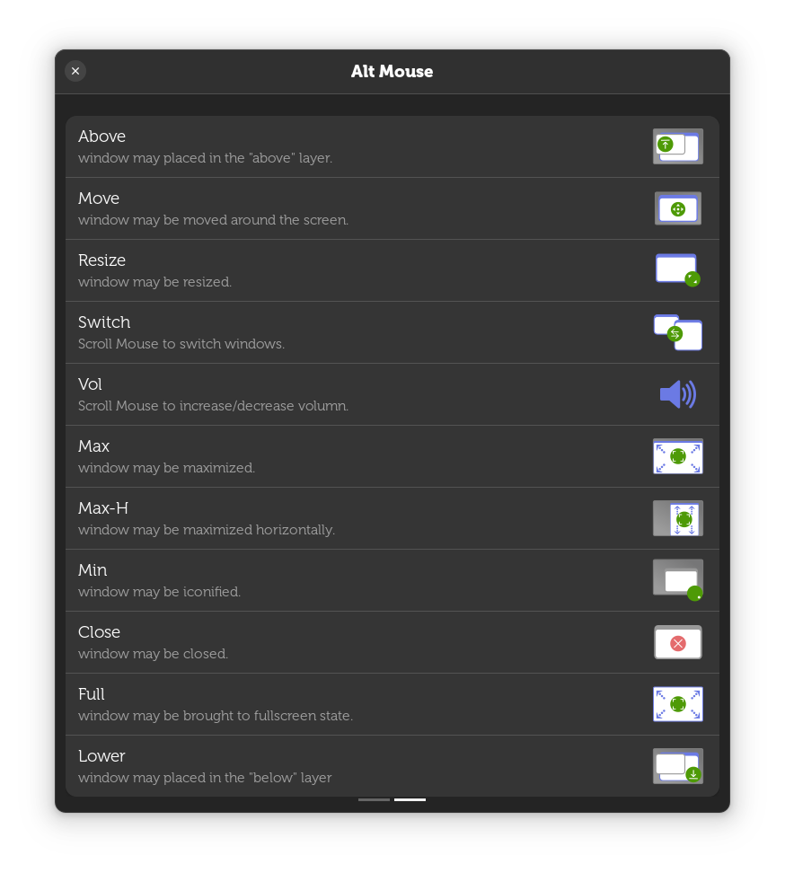

# gnome-shell-alt-mouse
Alt + Mouse control window

---

-| scroll up/down | butt 1|butt 2(middle)|butt 3
---|---|---|---|---
panel/desktop | switch window|move|resize|minimized
Alt + panel/desktop|volume|max(VERTICAL)|close|above

> Scroll: Down, cycle last two windows; Up, cycle all windows.

> 窗口置底/最小化后，滚轮下滚，可立刻恢复原貌。After the window is lower / minimized, scroll down to recovery window immediately.

> Disable desktop BackgroundMenu, Disable Panel dragMode.

> Add a `gap` at right screen edge.

> Add `Top-Left` and `Top-Right` corner as hot coner.

